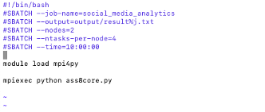

# Parallelised data processing and analysis of 100gb json files on HPC

Developer: Gaoyuan Hao Yulin Dong

# Summery

The aim of this assignment is to implement a parallelized application on SPARTAN for processing a large Twitter dataset to identify the happiest and most active hours and days. During the application, the run time for each different node and core combination will be recorded and further analysed later in this report. This report will include the script we use for submitting the job to SPARTAN, the MPI approach we took to parallelize our code, the logic of processing the JSON file, the output, and the performance on different numbers of nodes and cores.

# Methodology

We basically define a SLURM job named “social_meida_analytics” and setting the number of nodes of cores we use by assigning different “nodes” and “ntasks-per-node” (4 core for each node and 2 nodes in total in this sample). We load the necessary MPI module (mpi4py) to enable parallel processing within the python environment.
Then, the python script “ass8core.py” will be executed by using mpiexec, which helps the parallel execution of the script across the nodes and tasks we set above. Based on this approach, we can run parallelized analytics on the Twitter dataset and utilize HPC resources efficiently to handle the computational workload.
For dividing the data, in our design, the dataset is divided among different MPI process (ranks) based on the number of available MPI processes and the rank of each process. Each MPI process reads a specific portion of the JSON file and run the analyse function on its allocated portion.
Therefore, MPI process will operate independently on its portion of the data, minimize communication overhead, and enable faster processing of the dataset.
However, the 100gb data is too big to read all in memory. We cannot use the JSON index split data directly, which will cause the memory overflow. So, we decide to use seek() function to jump to the specific byte position which calculated by overall file byte size/number of available MPI process. This method reads a specific location directly from memory without traversing the entire file to get the location. But the program cannot make sure the seek position is the begin of one row. So we worked out a way to locate the JSON file position. Since all ROW data in a JSON file is a complete JSON structure data and is accessed on a row-by-row basis, We can skip this incomplete line directly through json.readline() function and get a complete json data instead. We use this way to read different part of the json file independently without divide the file and avoid preprocessing. Thus, we can parallelize the computation by having each core process only a small part of the file.
While the dataset was processed, for those tweets without sentiment scores or with a sentiment that is not a number (like a list or dict), we decide to ignore them. They will be added up in hours and the result will be stored in a dictionary, including both sentiment score and number of tweets in each hour. After each core completes its computation, it will send the dictionary back to the root process, which is rank 0 using MPI communication. The root will then process and identify the happiest hour, happiest day, most active hour, and most active day based on the combined dictionary. And the runtime will be count during the entire process.
